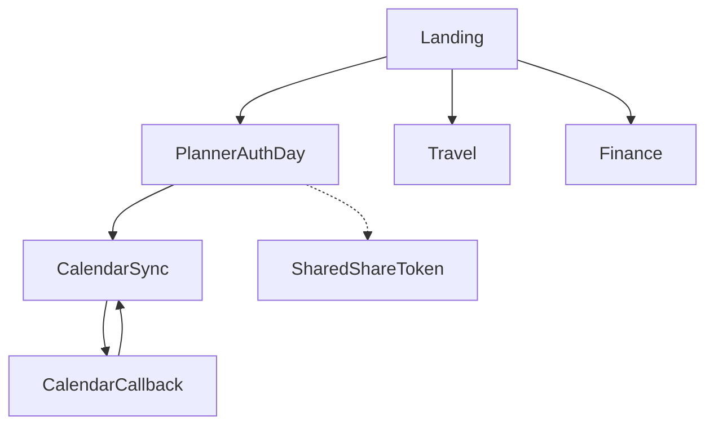

# Google Stitch — Life Planner (full app prompt)

Copy everything under **“Prompt (paste into Stitch)”** into [Google Stitch](https://stitch.withgoogle.com/). Then use follow-ups such as:

> Produce **mobile and desktop** frames for every screen listed. Start with **Landing**, **Day Planner (signed-in)**, **Shared planner**, and **Calendar sync**; then **Travel**, **Finance**, **Login**, **OAuth callback**, and **system states**.

---

## Context (for you — optional to paste into Stitch)

| Route | Purpose |
|--------|---------|
| `/` | Landing hub |
| `/planner` | Auth → Day Planner (guest or Supabase user) |
| `/travel` | Trip form + generated plan |
| `/finance` | Placeholder |
| `/calendar` | Google Calendar connect + sync (signed-in) |
| `/calendar/callback` | OAuth return |
| `?share=TOKEN` | Shared planner (bypasses router; view or edit) |
| `?previewSharedShell=1` (dev only) | Preview shared shell without Supabase |

**Implemented design system (Tailwind `share.*`):**  
Background `#111316`, on-background `#e2e2e6`, primary `#00daf3`, on-primary `#00363d`, primary-container `#00b6cb`, surfaces `surfaceContainer` / `High` / `Highest` / `Low`, `onSurface`, `onSurfaceVariant`, `outlineVariant` `#3d494d`, secondary `#a1cddd`, tertiary `#ffb77d`.  

**Typography:** **Epilogue** (`shareHeadline`) for marketing titles and key page H1s; **Manrope** (`shareSans`) for UI body. **Material Symbols Outlined** for icons (help, home, target, flight, account_balance, etc.).

**Global shell (`AppChrome`):** Fixed **top bar** (blur, dark glass): logo “Life Planner” → Home, **Day Planner**, Travel, Finance; **Calendar** link only when signed in; optional **Help** (planner); **trailing** slot (e.g. “Open planner” CTA on landing, **account menu** on planner). **Mobile:** fixed **bottom tab bar** (md+ hidden) — **Home**, **Planner** (or **Focus** on shared view), **Travel**, **Finance**; active tab uses primary tint. Main content: `max-w-7xl` (some pages `max-w-4xl` / `max-w-3xl` / `max-w-xl`), top padding clears fixed header (~`pt-24`), bottom padding clears mobile tabs (`pb-28` mobile).

---

## Prompt (paste into Stitch)

**Product:** **Life Planner** — one app for **day planning** (time-blocked tasks, weekly stats, deep-work timer, monthly habits/sleep/mood), **travel planning** (form → structured plan), **financial planner** (placeholder), **Google Calendar** manual two-way sync (signed-in), and **share links** for view-only or collaborative edit. Stack mindset: React + Tailwind; dark-first; calm productivity.

**Design goals:** **Mobile-first**, then desktop. **Accessible:** focus rings, semantic headings, touch targets ≥44px on mobile, `aria` on alerts/status. **No** generic purple AI gradients. **Primary chroma** = cyan/teal (`#00daf3`). Cards: `rounded-xl`, subtle borders (`outlineVariant`), elevated surfaces. Primary buttons: **filled primary** with **dark on-primary text**; secondary: bordered surface-high. **High contrast** text on dark backgrounds.

**Global navigation (all main routes except raw share loading/error):**

1. **Desktop (md+):** Horizontal nav under logo: Home | Day Planner | Travel | Finance | **Calendar** (visible only when authenticated). Current route: **underline + primary** on active link.
2. **Mobile:** Bottom **four-tab** bar: Home → `/`, Planner → `/planner` (on **shared** link, middle tab is **“Focus”**, current page, not a new destination), Travel → `/travel`, Finance → `/finance`. Calendar is **not** a fifth tab — reach via top bar when signed in or account menu.
3. **Planner-only:** Top bar **Help** icon opens help; **Account menu** (avatar initial + email truncate) with: Help & tips, Progress dashboard (scroll to `#progress-dashboard`), Monthly tracker (`#tracking-dashboard`), Calendar sync (signed-in only), Share… (signed-in only), Sign out.

---

### Screen 1 — Landing (`/`)

- **App chrome:** Same fixed top bar; **trailing:** primary CTA **“Open planner”** (desktop). **Mobile:** duplicate primary CTA below hero subcopy (full width acceptable).
- **Hero:** Large **Epilogue-style** headline: *Plan your day, work, trips, and money in one place.* Subcopy: personal hub without clutter.
- **Hub grid (1 col → 2 → 3):** Three **link cards**: **Day Planner**, **Travel Planner**, **Financial Planner** — title, short description, **CTA text + arrow**. Hover: border shifts toward primary.
- **Empty edge cases:** None beyond standard responsive stacking.

---

### Screen 2 — Day Planner — loading (`/planner`, auth loading)

- Full chrome, **no** bottom mobile nav (optional) or simplified; centered muted text: *Loading your workspace…*

---

### Screen 3 — Day Planner — login (`/planner`, unauthenticated)

- **App chrome** without bottom tabs or with them — match app pattern.
- **Centered card** (`max-w-md`): title **Life Planner**, short explainer (sync across devices or guest). **Email**, **password** fields; primary **Sign in** / **Create account** toggle link; **Continue as guest**. Error + info messages. Styled with same surface/border/primary system as rest of app.

---

### Screen 4 — Day Planner — main (`/planner`, guest or signed-in)

- **Chrome:** Help + **Account menu** (guest: fewer items; signed-in: calendar, share, sign out).
- **Sticky zone** below fixed header (~`top-16` equivalent): **Day header** — eyebrow *Today’s plan*; optional **badges** (streak 🔥, best streak, days missed / 0 missed, days since first use); **large date**; **Prev / Next / Today**; **weighted completion** (points bar) when tasks exist.
- **Owner-only row** (not shared): empty-day **Fill / Copy** from yesterday, same weekday, or last day with tasks; **multi-select delete** bar when tasks selected; **time offset** −30m / +30m / Reset for section time blocks.
- **Task column (fixed section order):**  
  **3 things MUST be done today** → **Morning routine** → **High Priority (Focus)** → **Medium** → **Low** → **Night routine** → **Sleep** block (no tasks; timeframe label; optional highlight late night).  
  Each section: title, optional description, **active timeframe** label when current; **add task**; tasks with checkbox, optional **scheduled time** + **duration**, subtasks, **due/highlight** state; drag handle (owner); section can show **active block** emphasis.
- **Desktop (`lg+`):** **Resizable split:** left = all sections + sleep; **vertical splitter**; right **sticky sidebar:** **Weekly overview** (7-day completion), **Deep work timer**, **Motivation card** (quote). **Owner only** for timer + motivation.
- **Below fold (owner):** **Monthly tracking** — month nav, optional **chapter title** for month, **habits** checklist, **sleep hours**, **mood** for days; supportive copy (not medical).
- **Modals/overlays:** **Help**; **Onboarding tour** (spotlight); **Share** (link + view vs edit) when signed in.

---

### Screen 5 — Shared planner (`?share=TOKEN`, success)

- **Top permission strip (fixed, z above header):** icon + sentence (**view only** vs **edit** instructions) + pill **View only** / **Edit access**; optional dev **Local preview** chip.
- **Second row:** Same **global top bar** as app but positioned **below** permission strip (logo + Home, Day Planner, Travel, Finance — **no** Calendar for anonymous visitor; **trailing** = simple avatar placeholder icon, no real account menu).
- **Main grid (lg: 8 + 4):**  
  **Left:** Hero **“Today’s Focus”**, date line (*Weekday, Month D · Shared with you*), primary **“Open in app”** → `/planner`; below = **same task column + sleep** as Screen 4 but **no** internal weekly sidebar (single column). **View:** no add/edit/drag; **Edit:** add/complete/delete only. No copy-from-day, no time offset, no timer/motivation/monthly dashboard, no share modal.
- **Right sidebar:** **Shared participants** (Owner / You + role); **Day progress** (% bar + completed vs remaining root tasks for **selected day**); **About this link** short legal/UX note.
- **Mobile bottom tabs:** Home, **Focus** (current), Travel, Finance.
- **FAB-style pill (optional):** *Shared live view* with pulse dot.

---

### Screen 6 — Shared planner — loading / error

- **Loading:** Full viewport, background + font match app; centered *Loading shared planner…*
- **Invalid/expired link:** Title **Link not found or expired**, explanation, secondary button **Go to Life Planner** → `/`.

---

### Screen 7 — Calendar sync (`/calendar`, signed-in)

- **Chrome** with **Calendar** highlighted in top nav; mobile tabs highlight **Planner** as “home hub” or neutral per your system.
- **Page title** Calendar sync; subcopy: connect one calendar, sync events ↔ tasks.
- **Card 1 — Connect:** Short trust copy (encrypted refresh token on server); primary **Connect Google Calendar**; errors inline.
- **Card 2 — Choose calendar:** Primary calendar called out in copy; **dropdown** of calendars; **Save** secondary; empty state when not connected yet.
- **Card 3 — Sync now:** v1 **manual** sync; primary **Sync from Google**, secondary **Sync to Google**; success/error/status lines.

---

### Screen 8 — Calendar sync — signed out

- Narrow layout: title, *Sign in to connect*, link **Back to Day Planner**.

---

### Screen 9 — Calendar OAuth callback (`/calendar/callback`)

- Minimal: **Calendar connection**; states: working / success / failure message; link **Go to Calendar sync**.

---

### Screen 10 — Travel (`/travel`)

- **Chrome** + mobile tab **Travel** active.
- **Title** Travel Planner; subcopy about packing, places, tips.
- **Form (when no plan):** Grid fields — **origin**, **destination*** , **purpose** select, **duration** number; **life stage** chips; **budget** chips; **accommodation** chips; optional **benefits** text; primary **Generate plan**; loading/disabled state; error alert.
- **Results (when plan exists):** **Edit inputs** + **New trip** secondary actions; stacked **cards**: Packing list (bullets), Where to stay, Places to visit, Things to do, Getting around, Prepare for the unexpected.

---

### Screen 11 — Finance (`/finance`)

- **Chrome**; **Financial Planner** title; short description; large **empty state card**: coming soon — budget, goals, spending.

---

### Component & token notes for handoff

- Prefer naming in specs: **share/bg, share/onSurface, share/primary, share/surfaceContainer***, **share/outlineVariant** for borders.
- **Radius:** cards `xl`; buttons `lg`–`xl` where prominent.
- **Icons:** Material Symbols Outlined, ~24px, align with labels in nav and buttons.
- **Planner section IDs** (for engineering alignment): `mustDo`, `morningRoutine`, `highPriority`, `mediumPriority`, `lowPriority`, `nightRoutine`.

**Deliverables from Stitch:** For **each** screen above: **mobile** + **desktop** frame; specify **spacing scale** (4/8 grid), **type scale** (hero / H1 / body / caption), and note **which chrome elements** repeat vs vary. Optional: **component sheet** (buttons, inputs, cards, nav, tabs, badges, progress).

---

## Information architecture (append to Stitch if useful)

---

## Engineering alignment

Routes and domain types live in `src/App.tsx`, `src/domain/types.ts`, and layout in `src/components/layout/AppChrome.tsx`, `src/components/planner/SharedPlannerShell.tsx`. Use this prompt so Stitch output maps cleanly to those boundaries.
